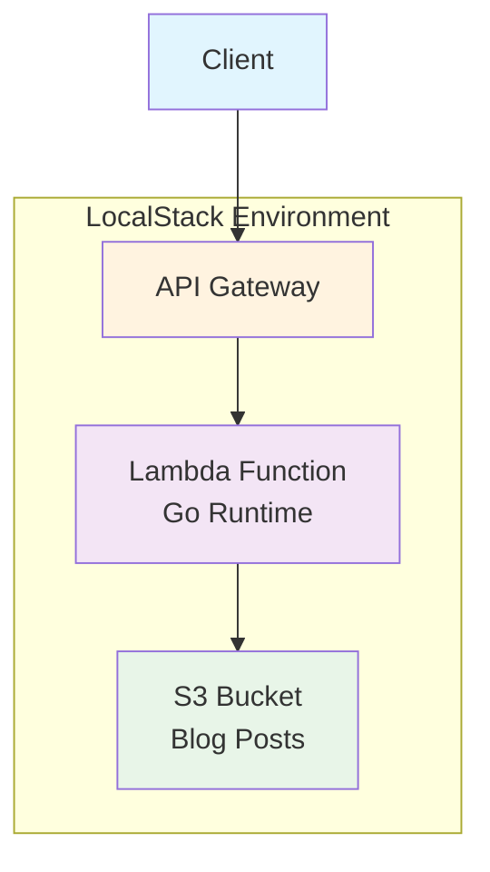

# CDK Go Blog API

AWS CDK（Go）とLambda（Go）を使用したサーバーレスブログAPIプロジェクトです。LocalStack上で動作し、クラウドコストをかけずにローカルで開発・テストできます。

## 🚀 クイックスタート

### 前提条件

- Docker Desktop が起動している
- Go 1.21+ がインストール済み
- Node.js がインストール済み

### 1. LocalStack 起動

```bash
docker compose up -d
```

### 2. 初回セットアップ

```bash
# Bootstrap（初回のみ）
make bootstrap

# デプロイ
make deploy
```

### 3. API 使用開始

```bash
# API エンドポイント取得
REGION=${AWS_DEFAULT_REGION:-us-east-1}
REST_API_ID=$(awslocal --region "$REGION" apigateway get-rest-apis | jq -r '.items[0].id')
BASE="http://localhost:4566/restapis/${REST_API_ID}/prod/_user_request_"

# 記事作成
curl -X POST -H "Content-Type: application/json" \
  -d '{"id":1,"title":"Hello","content":"# Hello World\nMy first post!"}' \
  "${BASE}/posts"

# 記事一覧
curl "${BASE}/posts" | jq
```

## 📋 API エンドポイント

| メソッド | エンドポイント | 説明         |
| -------- | -------------- | ------------ |
| GET      | `/posts`       | 記事一覧取得 |
| GET      | `/posts/{id}`  | 記事個別取得 |
| POST     | `/posts`       | 記事作成     |
| PUT      | `/posts/{id}`  | 記事更新     |
| DELETE   | `/posts/{id}`  | 記事削除     |

### リクエスト・レスポンス例

#### 記事作成（POST /posts）

```bash
curl -X POST -H "Content-Type: application/json" \
  -d '{"id":1,"title":"Hello","content":"# Hello World\nMy first post!"}' \
  "${BASE}/posts"
```

**レスポンス**:

```json
{
  "id": 1,
  "title": "Hello",
  "content": "# Hello World\nMy first post!"
}
```

#### 記事一覧（GET /posts）

```bash
curl "${BASE}/posts" | jq
```

**レスポンス**:

```json
[
  {
    "id": 1,
    "title": "Hello",
    "content": "# Hello World\nMy first post!"
  }
]
```

## 🔧 開発ワークフロー

### コード変更後の更新

```bash
# Lambda コードを変更した場合
make deploy  # ビルド + デプロイを自動実行

# CDK スタック定義を変更した場合
make synth   # テンプレート確認（任意）
make deploy
```

### ログ確認

```bash
# Lambda ログをリアルタイム監視
make logs
```

### 環境リセット

```bash
# スタック削除
make destroy

# LocalStack 再起動
docker compose down && docker compose up -d

# 再セットアップ
make bootstrap && make deploy
```

## 🏗️ アーキテクチャ



- **API Gateway**: RESTful APIエンドポイントの提供
- **Lambda**: Go製のサーバーレス関数（CRUD API）
- **S3**: ブログ記事データの格納（JSON形式）
- **LocalStack**: ローカル開発環境でのAWSサービスエミュレーション

## 📁 プロジェクト構造

```text
.
├── cdk-go.go              # CDKスタック定義
├── lambda/
│   └── cmd/
│       └── blog/
│           └── main.go    # Lambda関数の実装（CRUD API）
├── dist/
│   ├── blog/
│   │   └── bootstrap      # ビルド済みバイナリ
│   └── blog.zip           # デプロイ用ZIP
├── docs/                  # 構築手順書
├── docker-compose.yml     # LocalStack設定
├── Makefile              # ビルド・デプロイタスク
├── cdk.json              # CDK設定
└── go.mod                # Go依存関係
```

## 🛠️ 利用可能なコマンド

| コマンド            | 説明                           |
| ------------------- | ------------------------------ |
| `make build-lambda` | Lambda関数をビルド             |
| `make bootstrap`    | CDK bootstrap（初回のみ）      |
| `make deploy`       | ビルド + デプロイ              |
| `make destroy`      | スタック削除                   |
| `make synth`        | CloudFormationテンプレート生成 |
| `make logs`         | Lambda ログ監視                |

## 📚 ドキュメント

このアプリケーションを**ゼロから構築**したい場合は、[docs/](./docs/)の手順書を参照してください：

- [環境準備](./docs/getting-started/01-prerequisites.md) - 必要ツールのインストール
- [LocalStack セットアップ](./docs/getting-started/02-localstack-setup.md) - ローカル環境構築
- [CDK プロジェクト](./docs/getting-started/03-cdk-project.md) - プロジェクト初期化
- [Lambda 開発](./docs/getting-started/04-lambda-development.md) - API実装
- [CDK スタック](./docs/getting-started/05-cdk-stack.md) - インフラ定義
- [デプロイ](./docs/getting-started/06-deployment.md) - デプロイ手順

## 🔍 トラブルシューティング

よくある問題と解決策：

- [API使用方法](./docs/guides/api-usage.md) - CRUD操作の詳細
- [運用手順](./docs/guides/operations.md) - 更新・ログ・破棄
- [トラブルシューティング](./docs/guides/troubleshooting.md) - 問題解決

## 🚀 拡張機能

基本機能から拡張したい場合：

- [CRUD Lambda](./docs/reference/crud-lambda.md) - 完全版Lambda実装
- [Makefile タスク](./docs/reference/makefile-tasks.md) - ビルドタスク詳細
- [拡張ガイド](./docs/reference/extensions.md) - 認証・キャッシュ・検索等

## 🛡️ 技術スタック

- **CDK**: v2.219.0 (Go)
- **Lambda Runtime**: PROVIDED_AL2 (Go 1.23.0)
- **Go Dependencies**:
  - aws-lambda-go v1.49.0
  - aws-cdk-go/awscdk/v2 v2.219.0
  - aws-sdk-go-v2 (S3クライアント)
- **Development Tools**:
  - LocalStack 3.0+
  - aws-cdk-local v3.0.1
  - Docker Compose

## 📄 ライセンス

このプロジェクトはMITライセンスの下で公開されています。
