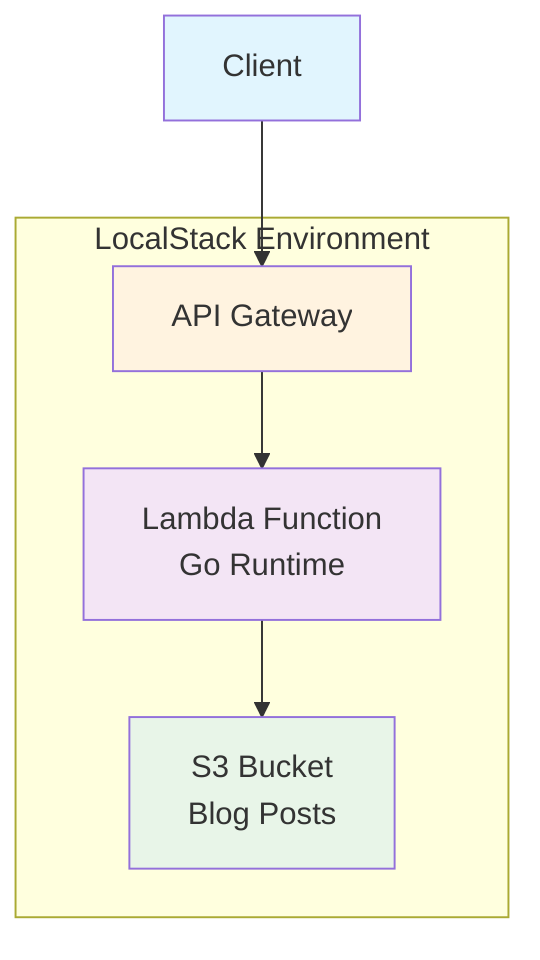

# CDK Go Blog API

AWS CDK（Go）とLambda（Go）を使用したサーバーレスブログAPIプロジェクトです。

## アーキテクチャ

```text
API Gateway → Lambda (Go) → S3 (記事データ)
```



- **API Gateway**: RESTful APIエンドポイントの提供
- **Lambda**: Go製のサーバーレス関数（記事取得API）
- **S3**: ブログ記事データの格納
- **LocalStack**: ローカル開発環境でのAWSサービスエミュレーション

## 技術スタック

- **CDK**: v2.219.0 (Go)
- **Lambda Runtime**: PROVIDED_AL2 (Go 1.23.0)
- **Go Dependencies**:
  - aws-lambda-go v1.49.0
  - aws-cdk-go/awscdk/v2 v2.219.0
- **Development Tools**:
  - LocalStack 3.0+
  - aws-cdk-local v3.0.1

## プロジェクト構造

```text
.
├── cdk-go.go              # CDKスタック定義
├── cdk-go_test.go         # CDKスタックのテスト
├── lambda/
│   └── cmd/
│       └── blog/
│           └── main.go    # Lambda関数の実装
├── dist/
│   └── lambda/
│       ├── blog/
│       │   └── bootstrap  # ビルド済みバイナリ
│       └── blog.zip       # デプロイ用ZIP
├── docker-compose.yml     # LocalStack設定
├── cdk.json              # CDK設定
├── go.mod                # Go依存関係
└── package.json          # CDK依存関係
```

## 参考資料

- [AWS CDK v2 Developer Guide](https://docs.aws.amazon.com/cdk/v2/guide/)
- [LocalStack Documentation](https://docs.localstack.cloud/)
- [AWS Lambda Go Developer Guide](https://docs.aws.amazon.com/lambda/latest/dg/lambda-golang.html)
- [詳細な手順書](./LOCALSTACK_CDK_GO_BLOG.md)
